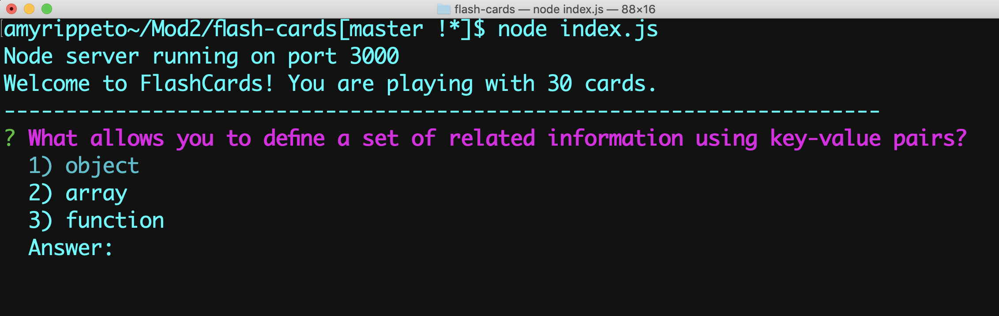

# FlashCards 

---

### Created by: Amy Rippeto - Turing School of Software & Design Student


## Objective:

FlashCards is a game played in the command line. The game is written in JavaScript implementing OOP and TDD. I used the testing framework Mocha and assertion library Chai. 

## Image of Game Start



## Example of Game Play


## Install and Play the Game

1. Clone this repository.

2. In your terminal command line change into the cloned directory and install the library dependencies.

```bash
npm install
```

3. Next start the game by running:

```bash
node index.js
```

4. The first question will appear, with possible answers.

5. Use your arrow or number keys to select your guess then hit enter.

6. The result of your guess will be shown, then hit enter to show the next question.

7. When you have answered all the questions you will see the percentage of correct answers and total time to complete the round.


